# Mini-Projet 1
**Cours : Sécurité des Systèmes d'Information – ECE 2025-2026**

---

## Partie 1A – Mise en place de l'environnement (Kali Linux)

### Réponse

L'environnement de travail est mis en place via **VirtualBox** avec une VM Kali Linux.

**Étapes clés :**
1. Téléchargement de VirtualBox sur [virtualbox.org](https://www.virtualbox.org/)
2. Téléchargement de l'ISO Kali Linux (64-bit VMware & VirtualBox) sur [kali.org/downloads](https://www.kali.org/downloads/)
3. Création de la VM : 4 Go RAM minimum, 30 Go disque, réseau en **Réseau interne**
4. Installation avec le compte `etudiant` et un mot de passe fort

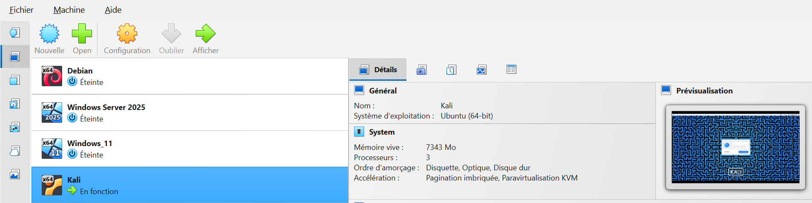

Le réseau interne isole la VM d'internet, ce qui est essentiel pour les labs de sécurité afin d'éviter tout impact sur le réseau réel.

---

## Partie 1B – Politique de mot de passe

### Réponse

Configuration du module `pam_pwquality` pour imposer des règles de complexité.

**1. Installation du module**
```bash
sudo apt update && sudo apt install libpam-pwquality -y
```

**2. Configuration de `/etc/security/pwquality.conf`**
```bash
sudo nano /etc/security/pwquality.conf
```
Contenu que j'ai modifié :
```
minlen = 12
minclass = 4
ucredit = -1
lcredit = -1
dcredit = -1
ocredit = -1
maxrepeat = 3
difok = 5
gecoscheck = 1
```

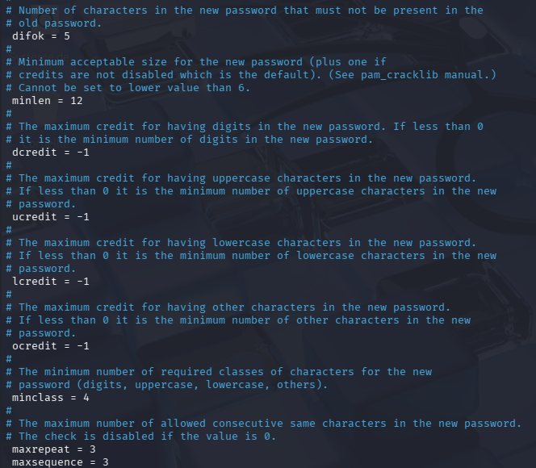

**3. Activation via PAM dans `/etc/pam.d/common-password`**
```bash
sudo nano /etc/pam.d/common-password
```
Ajouter avant la ligne `pam_unix.so` :
```
password requisite pam_pwquality.so retry=3
```

**4. Expiration du mot de passe (90 jours)**
```bash
sudo nano /etc/login.defs
PASS_MAX_DAYS 90

sudo chage -M 90 clement
```

**5. Test**
```bash
passwd etudiant
# Tester : "court" → refusé
# Tester : "M@tDeP@$$3Compl3xe!" → accepté
```

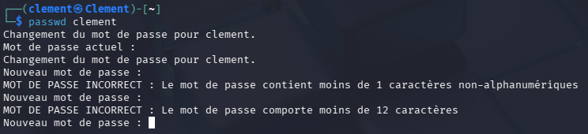
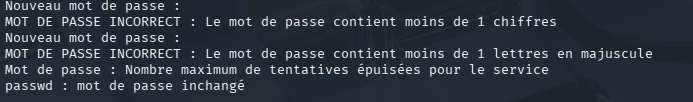

Un mot de passe complexe résiste aux attaques par force brute et dictionnaire. L'expiration limite la durée d'exposition d'un mot de passe compromis.

---

## Partie 1C – Authentification SSH par clé

### Réponse

Remplacement de l'authentification par mot de passe par une authentification par clé publique.

**1. Génération de la paire de clés**
```bash
ssh-keygen
```
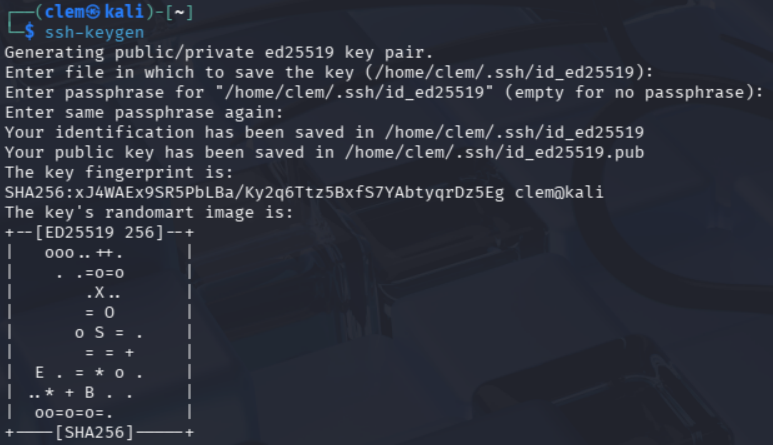

**2. Copie de la clé publique vers le serveur Ubuntu**
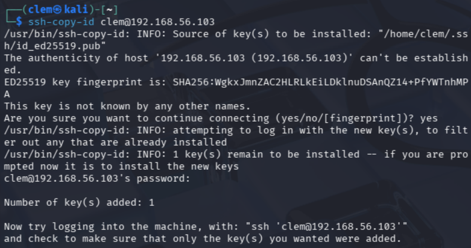

**3. Test de connexion par clé**
```bash
ssh Clement@<IP_UBUNTU>
# La passphrase est demandée (pas le mot de passe)
```

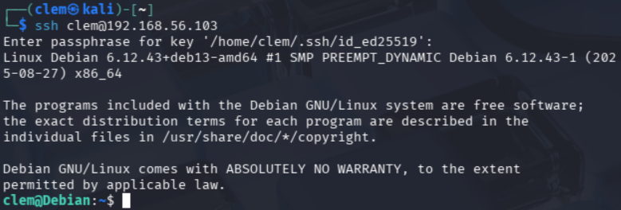

**4. Désactivation de l'authentification par mot de passe (sur Ubuntu)**
```bash
sudo nano /etc/ssh/sshd_config
PasswordAuthentication no
sudo systemctl restart sshd
```

**5. Vérification**
```bash
# Tentative par mot de passe
ssh -o PreferredAuthentications=password etudiant@<IP_UBUNTU>
```
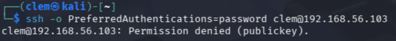

Une clé RSA 4096 bits est mathématiquement infaisable à brute-forcer. La passphrase protège la clé privée si elle est volée.

---

## Partie 1D – Wireshark & Nmap

### Réponse

**Wireshark – Capture de trafic ICMP**

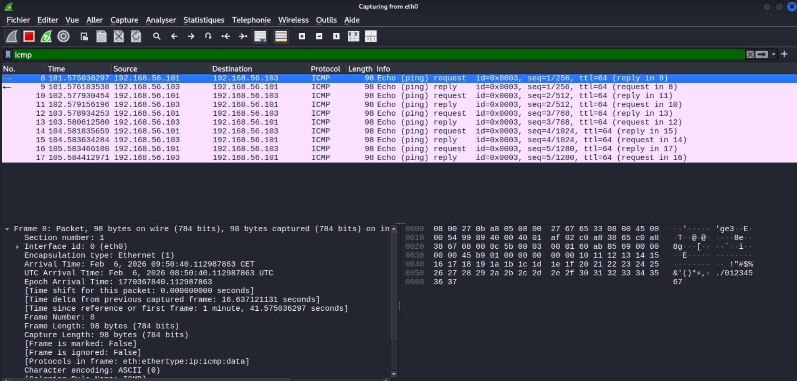

Informations visibles dans un paquet ICMP : IP source, IP destination, type ICMP (8 = request, 0 = reply), TTL.

**Nmap – Scan de ports**

```bash
# Scan SYN (discret)
nmap -sS 

# Détection des versions de services
nmap -sV 

```

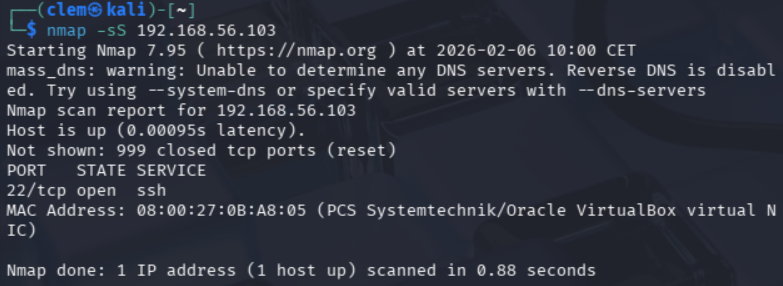
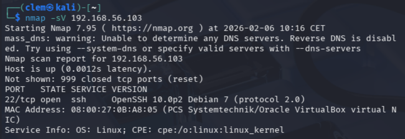

Wireshark permet d'inspecter en détail les échanges réseau (utile pour détecter des anomalies). Nmap est l'outil de référence pour la reconnaissance réseau et l'inventaire des services exposés.

---

## Partie 1E – Firewall basique avec iptables

### Réponse

**1. Voir l'état actuel**
```bash
sudo iptables -L -v
```

**2. Bloquer les requêtes Ping entrants**
```bash
sudo iptables -A INPUT -p icmp --icmp-type echo-request -j DROP
```

**3. Test depuis Kali**
```bash
ping -c <IP_UBUNTU>
# Résultat attendu : Request timeout (aucune réponse)
```

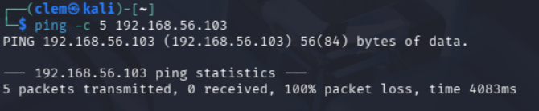

**4. Autoriser SSH (port 22)**
```bash
sudo iptables -A INPUT -p tcp --dport 22 -j ACCEPT
```

**5. Test SSH depuis Kali**
```bash
ssh Clement@<IP_UBUNTU>
# Doit fonctionner malgré le ping bloqué
```

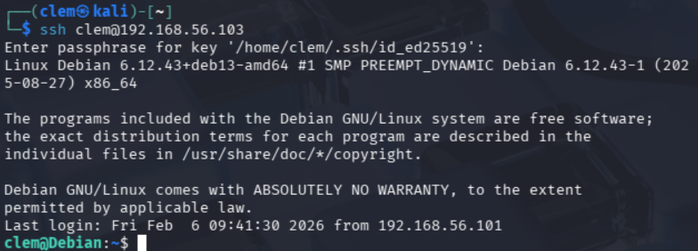

**6. Nettoyage des règles**
```bash
# Voir les règles avec numéros
sudo iptables -L --line-numbers

# Supprimer une règle spécifique ex: ligne 1
sudo iptables -D INPUT 1

# Tout réinitialiser
sudo iptables -F
sudo iptables -P INPUT ACCEPT
```

Un firewall filtre le trafic de façon sélective : on peut bloquer le ping qui sert à la reconnaissance réseau tout en gardant SSH opérationnel. L'ordre des règles est crucial : elles sont évaluées de haut en bas.

---
