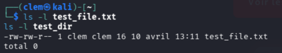
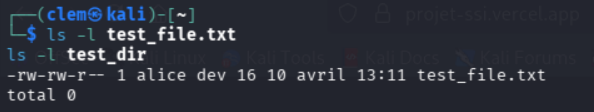
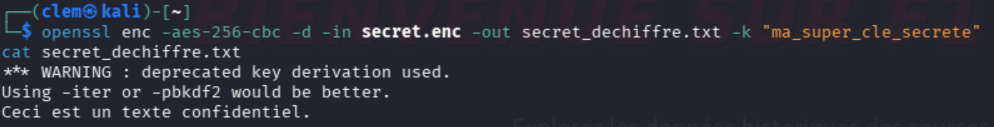
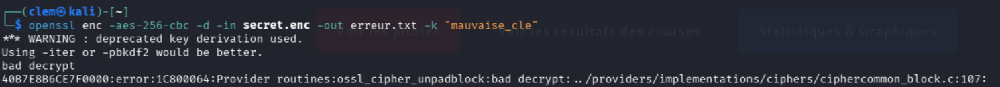
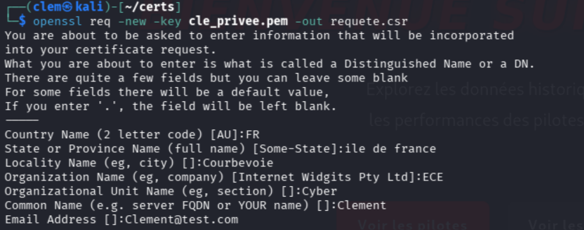
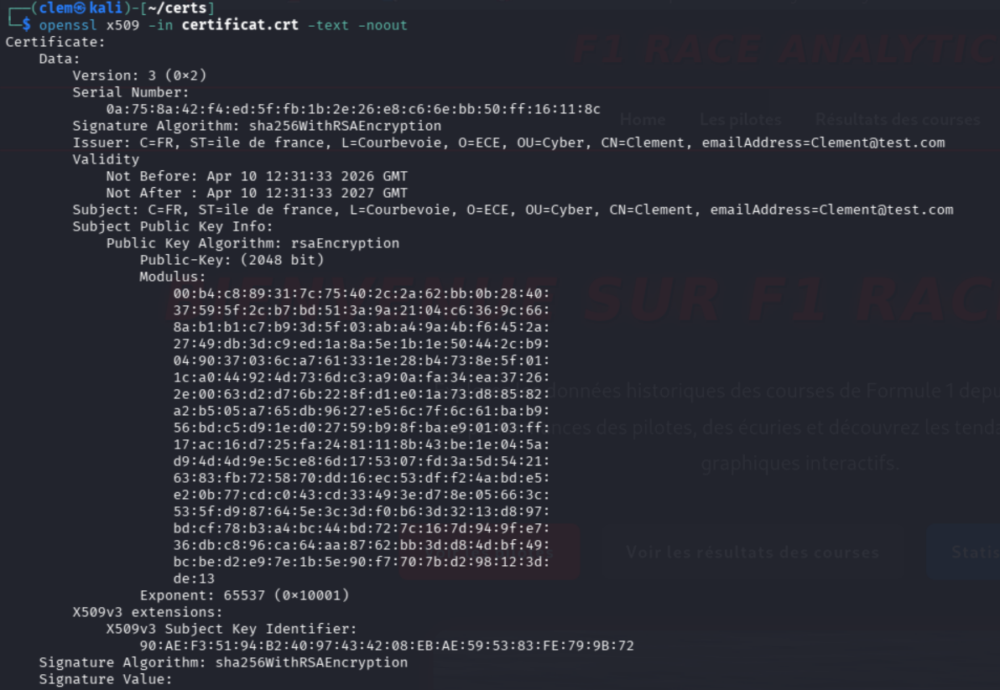
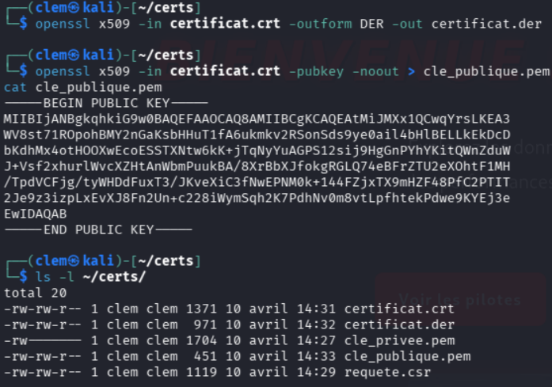
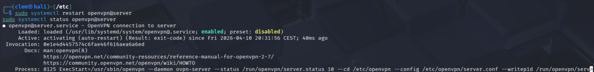

# Mini-Projet 2 
**Cours : Sécurité des Systèmes d'Information – ECE 2025-2026**

---

## Partie 2A – Permissions Linux

### Réponse

**1. Création des utilisateurs et groupes**
```bash
sudo adduser alice
sudo adduser bob
sudo addgroup dev
sudo usermod -aG dev alice
```

**2. Création des fichiers de test**
```bash
mkdir test_dir
touch test_file.txt
echo "Contenu de test" > test_file.txt
```

**3. Affichage des permissions actuelles**
```bash
ls -l test_file.txt
ls -l test_dir
```

Lecture de la sortie :
- 1er caractère : `-` = fichier, `d` = répertoire
- 3 suivants : permissions **propriétaire** (r=lecture, w=écriture, x=exécution)
- 3 suivants : permissions **groupe**
- 3 suivants : permissions **autres**



**4. Modification des permissions**

Pour donner `rw` à alice sur `test_file.txt`, aucun droit pour les autres :
```bash
sudo chown alice test_file.txt
chmod 640 test_file.txt
# 6 = rw pour propriétaire, 4 = r pour groupe, 0 = rien pour les autres
```

Donner `rwx` au groupe `dev` sur `test_dir` :
```bash
sudo chgrp dev test_dir
chmod 770 test_dir
# 7 = rwx pour propriétaire, 7 = rwx pour groupe, 0 = rien pour les autres
```

**5. Changement de propriétaire**
```bash
sudo chown alice test_file.txt          # Change le propriétaire
sudo chgrp dev test_dir                 # Change le groupe
sudo chown alice:dev test_file.txt      # Change les deux en une commande
```

**6. Vérification finale**
```bash
ls -l test_file.txt
ls -l test_dir
```



Le principe du **moindre privilège** consiste à n'accorder que les droits strictement nécessaires. Si un compte est compromis, l'attaquant ne peut accéder qu'aux fichiers autorisés pour ce compte, limitant ainsi les dégâts.

---

## Partie 2B – Chiffrement avec OpenSSL

### Réponse

**1. Création du fichier à chiffrer**
```bash
echo "Ceci est un texte confidentiel." > secret.txt
cat secret.txt
```

**2. Chiffrement avec AES-256-CBC**
```bash
openssl enc -aes-256-cbc -e -in secret.txt -out secret.enc -k "ma_super_cle_secrete"
```

**3. Visualisation du fichier chiffré**
```bash
cat secret.enc
# Affiche des caractères illisibles
```


**4. Déchiffrement**
```bash
openssl enc -aes-256-cbc -d -in secret.enc -out secret_dechiffre.txt -k "ma_super_cle_secrete"
cat secret_dechiffre.txt
Ceci est un texte confidentiel.
```



**Bonus – Tester avec une mauvaise clé**
```bash
openssl enc -aes-256-cbc -d -in secret.enc -out erreur.txt -k "mauvaise_cle"
erreur de déchiffrement ou texte corrompu
```


AES-256-CBC est un chiffrement symétrique : la même clé sert à chiffrer et déchiffrer. Sans la clé exacte, les données sont irrécupérables. Le mode CBC (Cipher Block Chaining) enchaîne les blocs, rendant chaque bloc dépendant du précédent.

---

## Partie 2C – Certificats auto-signés

### Réponse

**1. Génération de la clé privée**
```bash
openssl genrsa -out cle_privee.pem 2048
```
La clé privée doit rester **secrète**, ne jamais la partager.

**2. Génération de la CSR (Certificate Signing Request)**
```bash
openssl req -new -key cle_privee.pem -out requete.csr
```
Répondre aux questions :
- Country Name : `FR`
- Organization Name : `ECE`
- Common Name : `Clement` 



**3. Génération du certificat auto-signé (valide 365 jours)**
```bash
openssl x509 -req -in requete.csr -signkey cle_privee.pem -out certificat.crt -days 365
```

**4. Visualisation du certificat**
```bash
openssl x509 -in certificat.crt -text -noout
```
Informations visibles : émetteur, sujet, dates de validité, clé publique, algorithme de signature.



**5. Manipulations supplémentaires**
```bash
# Conversion PEM → DER (format binaire)
openssl x509 -in certificat.crt -outform DER -out certificat.der

# Extraction de la clé publique
openssl x509 -in certificat.crt -pubkey -noout > cle_publique.pem
cat cle_publique.pem
```


Un certificat auto-signé n'est pas signé par une autorité de certification (CA) reconnue (comme Let's Encrypt). Les navigateurs affichent donc une alerte de sécurité. Il est utile pour les tests et labs, mais pas pour la production.

---

## Partie 2D – VPN avec OpenVPN

### Réponse

**1. Installation (sur le serveur Ubuntu)**
```bash
sudo apt update
sudo apt install openvpn easy-rsa -y
```

**2. Configuration du répertoire serveur**  
```bash
sudo mkdir /etc/openvpn/server
sudo cp /usr/share/doc/openvpn/examples/sample-config-files/server.conf /etc/openvpn/server/server.conf
sudo nano /etc/openvpn/server/server.conf
```
Décommenter ces lignes et enlever le `;` :
```
push "redirect-gateway def1 bypass-dhcp"
push "dhcp-option DNS 8.8.8.8"
```

**3. Génération des clés et certificats**
```bash
sudo make-cadir /etc/openvpn/easy-rsa
cd /etc/openvpn/easy-rsa
sudo ./easyrsa init-pki
sudo ./easyrsa build-ca nopass          # Création de l'autorité de certification
sudo ./easyrsa build-server-full server nopass   # Certificat serveur
sudo openssl dhparam -out dh.pem 2048   # Paramètres Diffie-Hellman

# Copie dans le répertoire OpenVPN
sudo cp pki/ca.crt /etc/openvpn/server
sudo cp pki/issued/server.crt /etc/openvpn/server
sudo cp pki/private/server.key /etc/openvpn/server
sudo cp dh.pem /etc/openvpn/server
sudo chown -R root:root /etc/openvpn/easy-rsa
```


**4. Génération des clés client**
```bash
cd /etc/openvpn/easy-rsa
sudo ./easyrsa build-client-full client1 nopass
```

Créer le fichier `client.ovpn` :
```
client
dev tun
proto udp
remote <IP_SERVEUR> 1194
resolv-retry infinite
nobind
persist-key
persist-tun
remote-cert-tls server
verb 3
<ca>
# Coller ici le contenu de /etc/openvpn/easy-rsa/pki/ca.crt
</ca>
<cert>
# Coller ici le contenu de pki/issued/client1.crt
</cert>
<key>
# Coller ici le contenu de pki/private/client1.key
</key>
```

Copier le fichier vers le client avec `scp` :
```bash
scp client.ovpn etudiant@<IP_CLIENT>:~/
```

**5. Démarrage du serveur**
```bash
sudo systemctl enable openvpn@server
sudo systemctl start openvpn@server
sudo systemctl status openvpn@server
```



**6. Connexion depuis le client**
```bash
sudo openvpn --config client.ovpn
```

**7. Vérification du tunnel**
```bash
# Vérifier la nouvelle interface tun0
ip a show tun0

# Pinger le serveur VPN via le tunnel
ping 10.8.0.1

# Voir les logs côté serveur
sudo tail -f /var/log/syslog
```
OpenVPN crée un tunnel chiffré entre le client et le serveur. Tout le trafic transite par ce tunnel, ce qui le protège des écoutes. Le système de certificats (PKI) garantit l'identité des deux parties et évite les attaques de type man-in-the-middle.

---
